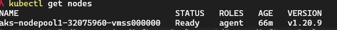
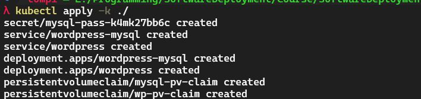
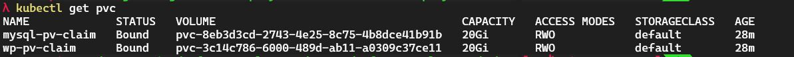

# Lab 4 

## Aufsetzen und Konfiguration eines AKS in Azure

URL of Cluster: 20.103.16.254

## Relevant files

### Kustomization file

* This file will contain resource configs for:
  * MYSQL
  * WordPress
* Secret generator
  * Object that stores sensitive data (password or key)
  * In our case we storeo the password for our mysql db 

### Configuration files for MySQL and WordPress

* In our configuration files we require a PersistentVolume to store our data
  * This will be created during the deployment step
=> For this we create a PersistentVolumeClaim => PersistentVolumne is
dynamically provided based on the StorageClass configuration

We have two config files for:
* Wordpress 
  * Mounts PersistenVolume at /var/www/html
  * File name: wordpress-deployment.yaml 
* MySQL
  * Mounts PersistenVolume at /var/lib/mysql
  * The password which we set in the secrets of the `kustomization.yaml` will be replaces by the environment variable
	`MYSQL_ROOT_PASSWORD`
  * File name: mysql-deployment.yaml 

## Konfiguration und deplyoment von Wordpress incl. MySQL in dem AKS cluster 

* After we created a resource group: 

`az group create --name Name --location Location`

* Create Kubernetes cluster:

`az aks get-credentials --resource-group Name --name myAKSCluster`

* We can verify the connection to our cluster with:

`kubectl get nodes`

* Run the kustomization.yaml file which contain all resources for deploying a MySQL database and our wordpress service:
  * Apply it on the directory:

`kubectl apply -k ./`

* Verify that PersistentVolume got provisioned:

`kubectl get pvc`

